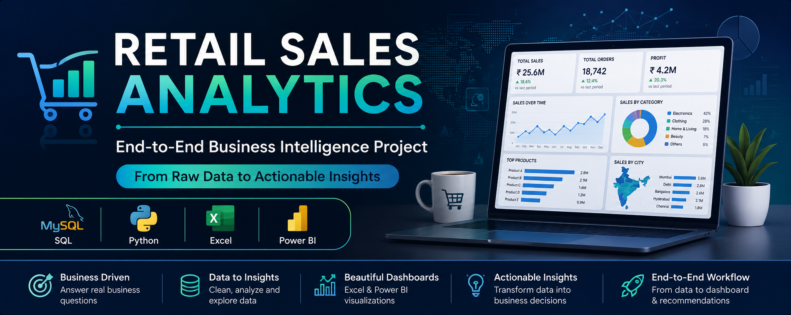

<p align="center">
  
</p>

# 🛍️ Retail Sales Analytics

> **An End-to-End Data Analytics Project using SQL, Python, Excel, and Power BI**


---

# 📌 Project Overview

This project simulates the responsibilities of a **Junior Data Analyst** working for a retail company.

Using real-world retail sales data, the project demonstrates how SQL, Python, Excel, and Power BI can be combined to transform raw transactional data into meaningful business insights and executive dashboards.

The objective is to build an industry-level analytics portfolio project that follows the complete analytics workflow—from data exploration to business recommendations.

---

# 🏢 Business Scenario

You have recently joined **RetailMart Pvt. Ltd.** as a Junior Data Analyst.

The management team wants to understand:

- Which products generate the highest revenue?
- Which cities contribute the most sales?
- How sales change over time.
- Which customers spend the most.
- Which product categories perform best.
- How business decisions can be improved using data.

Your responsibility is to answer these questions through data analysis.

---

# 🎯 Project Objectives

- Analyze retail sales performance.
- Identify revenue trends.
- Discover best-selling products.
- Evaluate customer purchasing behavior.
- Compare category performance.
- Create executive dashboards.
- Present business recommendations.

---

# 🛠️ Tech Stack

| Tool | Purpose |
|-------|----------|
| SQL (MySQL) | Database & Business Queries |
| Python | Data Cleaning & Analysis |
| Pandas | Data Manipulation |
| NumPy | Numerical Operations |
| Matplotlib | Data Visualization |
| Seaborn | Statistical Charts |
| Excel | Dashboard & Reporting |
| Power BI | Interactive Dashboard |
| Git | Version Control |
| GitHub | Portfolio Showcase |

---

# 📂 Project Structure

```text
Retail-Sales-Analytics/

│
├── data/
│   ├── raw/
│   └── processed/
│
├── sql/
│
├── python/
│
├── excel/
│
├── powerbi/
│
├── images/
│
├── reports/
│
├── docs/
│
├── README.md
│
└── requirements.txt
```

---

# 🔄 Project Workflow

```
Business Understanding
        │
        ▼
Dataset Collection
        │
        ▼
SQL Analysis
        │
        ▼
Python Data Cleaning
        │
        ▼
Exploratory Data Analysis
        │
        ▼
Excel Dashboard
        │
        ▼
Power BI Dashboard
        │
        ▼
Business Insights
        │
        ▼
Recommendations
```

---

# 📊 Project Progress

| Phase | Status |
|--------|--------|
| Repository Setup | ✅ Completed |
| Folder Structure | ✅ Completed |
| Dataset Selection | 🔄 In Progress |
| SQL Analysis | ⏳ Pending |
| Python EDA | ⏳ Pending |
| Excel Dashboard | ⏳ Pending |
| Power BI Dashboard | ⏳ Pending |
| Business Report | ⏳ Pending |
| Final Documentation | ⏳ Pending |

---

# 📈 Skills Demonstrated

- SQL
- Python
- Pandas
- NumPy
- Data Cleaning
- Exploratory Data Analysis
- Data Visualization
- Business Intelligence
- Dashboard Design
- Excel
- Power BI
- Git
- GitHub

---

# 🚀 Future Enhancements

- Sales Forecasting using Machine Learning
- Streamlit Dashboard
- Automated Reporting
- SQL Stored Procedures
- Interactive Web Dashboard

---

# 👩‍💻 Author

**Anitta Kurian**

MCA Graduate | Aspiring Data Analyst

Focused on building business-driven analytics solutions using SQL, Python, Excel, and Power BI.

---

⭐ If you found this project useful, consider giving it a star!